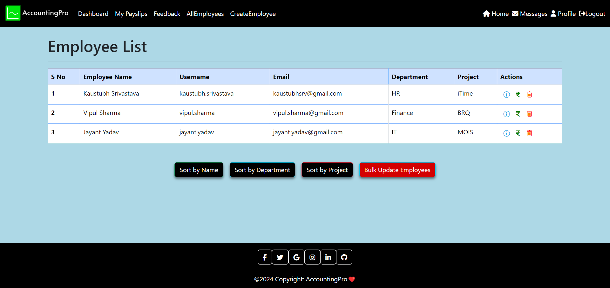
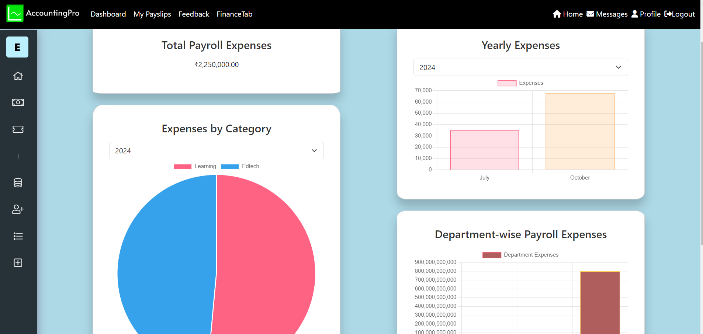
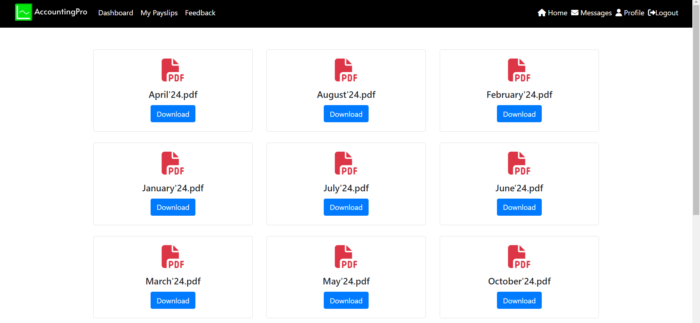
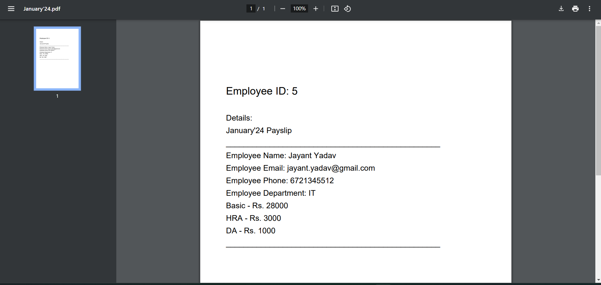
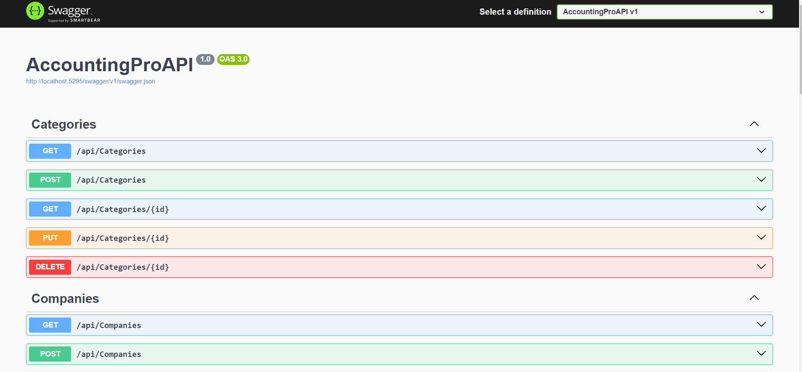

# AccountingPro

**AccountingPro** is a web-based accounting application designed for companies to manage employee-related data, financial records, and HR operations. It features role-based access for HR, Employees, and Finance, each with distinct functionalities such as managing employee records, accessing payslips, and overseeing expenses.

The application is deployed at [https://accountingpro-95b3b.web.app](https://accountingpro-95b3b.web.app).

You can login via following users (username = firstname.lastname | password = firstname123):-

Kaustubh Srivastava (HR), Vipul Sharma (Finance), Jayant Yadav (Employee), Riya Tomar (Employee)







## Project Structure

The project is organized into two main parts:
- **AccountingProAPI** - Contains the .NET Core web API code.
- **Angular Frontend** - Contains the Angular code for the front-end interface.

## Features

### Role-Based Access

- **HR**:
  - Perform CRUD operations on employee records.
  - Manage employee details and contracts.
- **Employee**:
  - View personal details.
  - Access payslips and other employee-specific information.
- **Finance**:
  - Manage expenses.
  - Perform financial reporting and audits.

## Installation

### Prerequisites

- [.NET Core SDK](https://dotnet.microsoft.com/download) (Version 7.0 or higher)
- [Node.js and npm](https://nodejs.org/en/download/)
- [Angular CLI](https://angular.io/cli)

### Backend Setup

- Navigate to the `AccountingProAPI` folder:
  ```bash
  cd AccountingProAPI
  ```
- Restore dependencies and build the API:
  ```bash
  dotnet restore
  dotnet build
  ```
- Run the API:
  ```bash
  dotnet run
  ```

### Frontend Setup

- Navigate to the Angular project folder:
  ```bash
  cd ../AccountingPro
  ```
- Install Angular dependencies:
  ```bash
  npm install
  ```
- Run the Angular application:
  ```bash
  ng serve
  ```
- Access the application at `http://localhost:4200`.

## Tech Stack

- **Frontend**: Angular
- **Backend**: .NET Core Web API
- **Database**: SQL Server
- **Authentication**: Firebase

## Folder Structure

- **AccountingProAPI**: Contains all server-side code, including controllers, models, and services.
- **AccountingPro**: Contains the client-side code, services, components, and routing modules.

## Contributing

- Fork the repository.
- Create a new branch.
- Make your changes.
- Submit a pull request.

## License

This project is licensed under the [MIT License](LICENSE).

